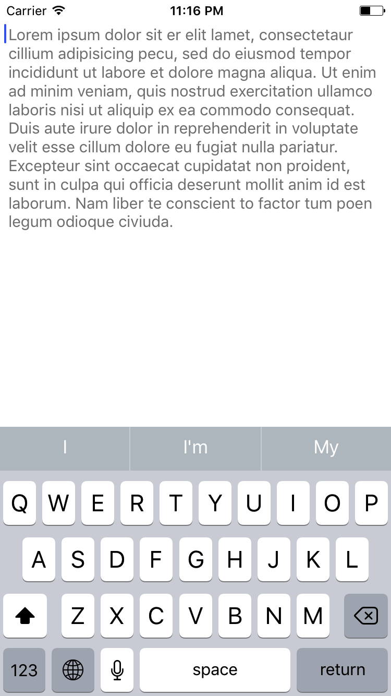
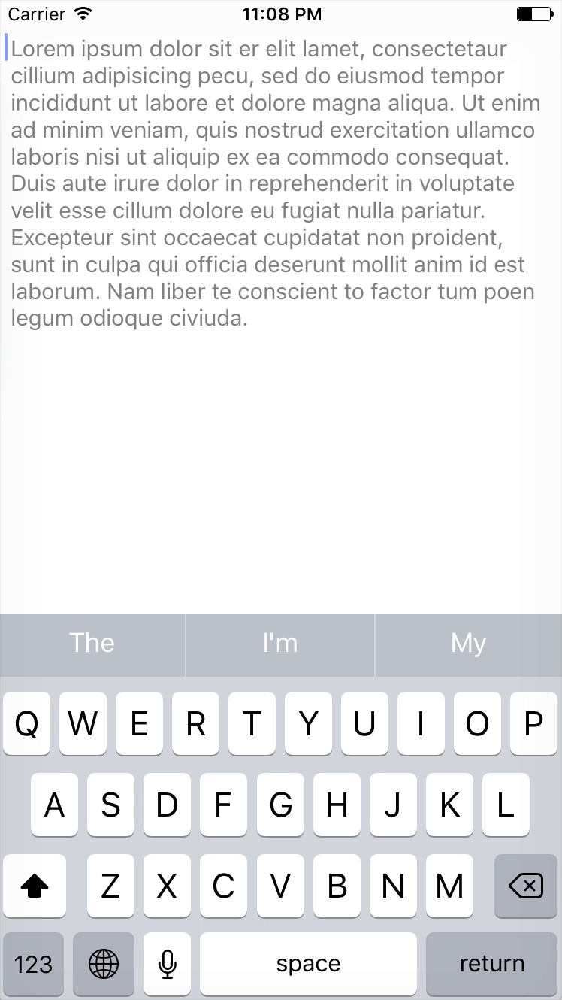

# PlaceholderTextView

[](https://github.com/Carthage/Carthage)

<p align="center">
  
  
</p>

## Requirements

Swift **3.0**
iOS **9.0+**

## Installation

### Carthage

PlaceholderTextView is available through Carthage. To install it, simply add the following line to your Cartfile:
```
github "yusayusa/PlaceholderTextView"
```

### CocoaPods

TODO

## Usage
```swift
let textView: UITextView

// set placeholder
let attribute = NSAttributedString(string: "placeholder",
                               attributes: [NSFontAttributeName: UIFont.systemFont(ofSize: 15),
                                            NSForegroundColorAttributeName: UIColor.gray,
                                            ])
textView.setPlaceholder(attribute: attribute)
```

## License
PlaceholderTextView is released under the MIT license. Go read the LICENSE file for more information.
